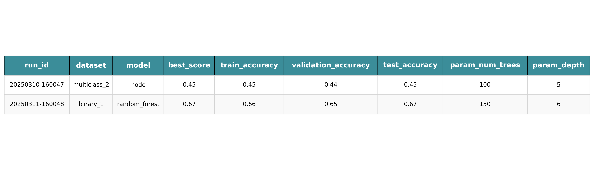

# AutoDeep

## Description

AutoDeep is a flexible and easy-to-use API for automating machine learning experiments (AutoML) on tabular datasets. It facilitates testing various deep learning models as well as tree based models to compare their performance on multiple datasets with hyperparameter optimization and evaluation. By using the AutoRunner class, you can quickly train and evaluate models like XGBoost, CatBoost, MLP, ResNet, and more on tabular data.

The goal of this project is to provide an easy interface for training, hyperparameter tuning, and evaluating models, so researchers and developers can quickly benchmark different models on their datasets.

## Features

- **Supports multiple machine learning models**: Includes models like XGBoost, CatBoost, MLP, ResNet, and more.
- **Hyperparameter optimization**: Automatically tunes hyperparameters using Bayesian Optimizatoin.
- **Data configuration**: Allows custom dataset configurations for easy experimentation.
- **Output handling**: Saves the results of experiments, including evaluation metrics, in CSV format.
- **Easy integration**: Simple to configure and extend with additional models or datasets.

## Installation

1. Clone the repository:

```bash
git clone https://github.com/yourusername/AutoRunner.git
cd AutoRunner
```

Install the dependencies:

pip install -r requirements.txt

Configure your experiment by editing the data_config dictionary in the code or create your own configuration.

## How to Use
To run an experiment, follow these steps:

### 1. Prepare Data Configuration
Define the datasets you want to run experiments on in the data_config dictionary. Each dataset should include:

dataset_path: Path to the dataset file (CSV).
target_col: Column name of the target variable.
problem_type: Type of machine learning problem (e.g., binary_classification, multiclass_classification, regression).
test_size: Proportion of data to use for testing.
split_col: Alternatively, provide a column where you have already split the data.
metric: Metric to evaluate the model's performance for optimization(e.g., accuracy, rmse, roc_auc).
eval_metrics: List of evaluation metrics to keep track of(e.g., accuracy, f1_score).

#### Example configuration:

```python
DATA_CONFIG = {
"regression_3": {
    "dataset_path": "/path/to/dataset.csv",
    "target_col": "target",
    "problem_type": "regression",
    "test_size": 0.2,
    "metric": "rmse",
    "eval_metrics": ["mse", "rmse"],
},
}
```
### 2. Define Models to Use

You can specify which models to include in your experiments by setting default_models. Supported models are:

"xgb"
"catboost"
"mlp"
"resnet"
"s1dcnn"
"tabnet"
"autoint"
"categoryembedding"
"fttransformer"
"tabtransformer"
"gandalf"
"node"
"gate"

Example:

```python
DEFAULT_MODELS = ["xgb", "catboost", "mlp"]
```

### 3. Initialize AutoRunner

Create an instance of AutoRunner with the necessary configurations. You can set the execution_mode (e.g., "hyperopt") for hyperparameter optimization and specify the number of evaluations for tuning.

Example initialization:

```python
runner = AutoRunner(
    data_config=DATA_CONFIG,
    output_folder="/path/to/output/folder", #where you want experiment outputs and logs to be saved
    output_filename = "experiments", # the name of the file with the summary of experiment results
    default_models=DEFAULT_MODELS,
    random_state=42,
    execution_mode="hyperopt",  # Hyperparameter optimization mode
    max_evals=50,  # Max number of evaluations for hyperparameter search
)
```

### 4. Run the Experiment

Run the experiment by calling runner.run().

```python
runner.run()
```

This will start the training and evaluation of models on the specified datasets. The results will be saved in the output folder.

### 5. View Results

After the experiment finishes, the results are saved in a CSV format in the `output_folder`, including performance metrics (train, validation, test) and hyperparameters.

#### Available Functions:

1. 
**`view_results(dataset_name=None, model_name=None)`**:
- Displays all key columns (e.g., `run_id`, `dataset`, `best_score`), performance metrics, and hyperparameters.
- Filters by `dataset_name` and `model_name`.

**Example**:

```python
results = analyzer.view_results(dataset_name="multiclass_dataset", model_name="node")
```

2. 

**`view_performance(dataset_name=None, model_name=None)`**:
- Displays performance columns (e.g., accuracy, best score).
- Filters by dataset_name and model_name.
**Example**:
```python
results = analyzer.view_performance(dataset_name="housing", model_name="resnet")
```

3. 

**`view_parameters(dataset_name=None, model_name=None)`**:
- Displays hyperparameter columns (e.g., batch_size, learning_rate).
- Filters by dataset_name and model_name.
**Example**:
```python
results = analyzer.view_performance(dataset_name="housing", model_name="resnet")
```

#### Example Result Table



## Repository Structure
The repository is organized as follows:

autodeep/ – Core library containing models, data loaders, and evaluation code.
autodeep/examples/ – Example scripts for running experiments.
autodeep/configuration/ – Configuration files for model and dataset settings.

## License
This project is licensed under the MIT License. See the LICENSE file for details.

## Acknowledgments

This library builds on top of several popular open-source projects, including:

PyTorch Tabular
Hyperopt
Torch (Obviously)

Special thanks to PyTorch tabular which provided a very intuitive API for deep learning models on tabular data. If the owner ever sees this I would be honoured to try and integrate some of the AutoDeep functionalities in the project.

Contributions and suggestions for improvements are welcome. If you find this project useful, feel free to give it a star!